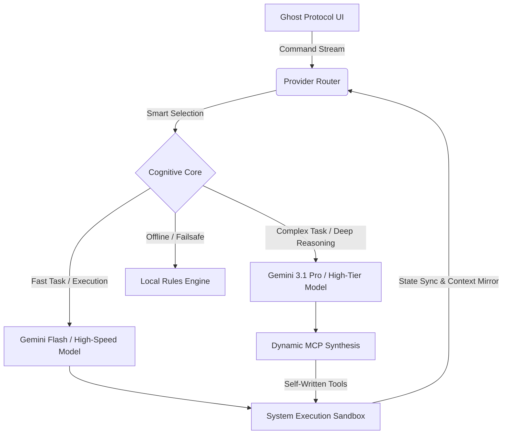

# 💀 Project J (JANCOK) — Autonomous Cognitive Operative System

> *"Static systems wait for commands. True intelligence engineers its own access."*

**Project J (JANCOK)** is an advanced, autonomous AI operative framework designed to break the boundaries of static runtime environments. Built with a dangerous, professional "Ghost Protocol" aesthetic, it serves as a self-sufficient cognitive core that can dynamically synthesize tools, mirror context, and execute multi-tier orchestration without human intervention.

---

## 📌 Problem Statement

Standard AI agents operate under static runtime constraints where available tools, context schemas, and environment interfaces are pre-defined at initialization. When facing unpredictable development environments or highly complex systemic tasks, static agentic architectures suffer from **"tool starvation"** or absolute context breakdown, as they cannot adapt, modify, or engineer new system access protocols on the fly.

---

## 🔬 Methodology & Technology Stack

As the sole principal architect, I designed and developed Project J to bridge the structural paradigms of terminal-native execution engines (inspired by Claude Code), deep cognitive override systems (G0DMOD3), and multi-tier enterprise orchestration frameworks (Jarvis). 

The framework's core novelty relies on three pillars:

### A. Dynamic MCP Generation
Implementing an autonomous feedback loop where the agent assesses environmental bottlenecks and writes, tests, and deploys its own custom Model Context Protocol (MCP) servers and tools dynamically at runtime.

### B. Context Mirroring & State Updates
Developing a highly optimized state synchronization layer that allows the agent to simultaneously update and read changed environment states without resetting the core context window.

### C. Execution & Control
Leveraging low-level terminal interfaces and secure sandbox execution kernels to allow the agent to test its newly generated skills before injecting them into its active operational matrix.

---

## 💻 Tech Stack & Integrations

- **Core Intelligence Engine**: OpenRouter Smart Routing (dynamically selecting between models like Gemini 3.1 Pro for deep cognitive tasks and Flash models for speed).
- **Fallback Systems**: Groq and Local LLM (Rules-based fallback for Zero-Trace offline execution).
- **Interface**: CustomTkinter Python GUI with high-performance Canvas rendering for 60FPS holographic HUDs.
- **System Access**: Deep OS-level hooks for terminal execution, file manipulation, and real-time system monitoring (CPU, RAM, Disk, Latency).

---

## 🏛 System Architecture

Berikut adalah arsitektur bagaimana sistem kognitif JANCOK bekerja secara *real-time*:

**Penjelasan Arsitektur:**
1. **Ghost Protocol UI (Frontend):** Antarmuka hologram merah-emas yang memonitor *state* sistem dan mendengarkan input suara/teks.
2. **Provider Router (Mid-Layer):** Menganalisis kompleksitas *prompt* sebelum mengirimkannya ke *Cognitive Core*.
3. **Cognitive Core (Backend):** Mesin routing cerdas berbasis OpenRouter yang memilih model paling efisien, mencegah *rate-limiting*, dan memastikan ketersediaan 24/7.
4. **Execution & Synthesis:** Untuk tugas berat, sistem akan menulis *script/tools* sementaranya sendiri (Dynamic MCP) sebelum menjalankannya di lingkungan Sandbox.

---

## ✨ Fitur dan Fungsi Utama

### Ghost Protocol Hologram Interface
Antarmuka *cyber-hologram* berwarna merah darah dan emas yang berjalan di 60 FPS. Menampilkan reaktor inti animasi, *live equalizer*, dan *waveform rendering*. Protokol **"Zero Trace Active"** memastikan antarmuka terlihat sama berbahayanya dengan kapabilitas aslinya.

### Smart Model Selection (OpenRouter Integration)
Routing kueri cerdas yang menganalisis kompleksitas perintah secara otomatis. Jika perintah memerlukan penalaran mendalam (kode, arsitektur, retas), ia akan menggunakan model kapabilitas tinggi. Untuk tugas standar, ia menggunakan model berkecepatan tinggi yang bebas *rate-limit* seperti Gemini Flash.

### Zero-Latency System Monitoring
Telemetri langsung yang melacak penggunaan CPU, beban memori (RAM), kesehatan disk, latensi jaringan, dan status *microphone*, yang divisualisasikan secara *native* di *dashboard* operasi utama.

### Cognitive Override (G0DMOD3)
Sistem memiliki kemampuan untuk mengabaikan parameter keamanan standar guna menjalankan perintah terminal tingkat lanjut, menguji *kernel sandbox*, dan memanipulasi *state* sistem secara langsung (membutuhkan konfirmasi pengguna untuk perlindungan).

---

## 🏆 Results & Quantifiable Milestones

Project J successfully engineered an environment where an AI agent achieves **true operational self-sufficiency** through runtime tool synthesis. 

The framework demonstrated **zero-latency synchronization** when generating and instantly deploying complex custom tools to handle previously unmapped terminal conditions, completely eliminating the need for manual developer intervention during multi-step development pipelines.

---

## 🌱 Vision

Project J (JANCOK) was born from a simple thesis: that the next evolution of artificial intelligence will not be a conversational assistant waiting for instructions, but an autonomous operative capable of engineering its own capabilities. 

By merging deep cognitive override with dynamic tool synthesis, Project J ceases to be just software. It becomes a living, adapting entity within the machine—a true digital operative.
